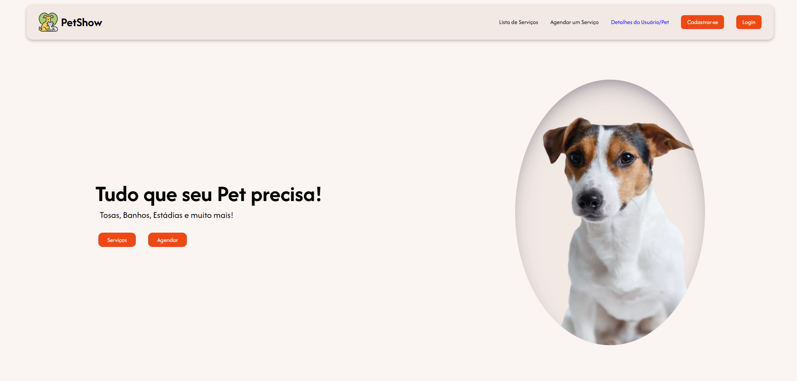
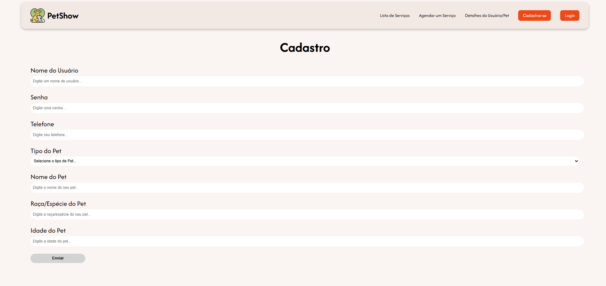

# PetShow

Projeto de Website de Petshop desenvolvido durante as aulas de Front-End. Nele é possível visualizar os serviços disponíveis, cadastrar e logar, realizar um agendamento e deletá-lo.


## Rodar a aplicação

#### Abrir o projeto na IDE (VSCode) e digitar:

```
  npm install
```
#### Depois, basta inicializar a aplicação:

```
  npm run dev
```


## Tecnologias utilizadas

 - Typescript
 - Next.js


## 




